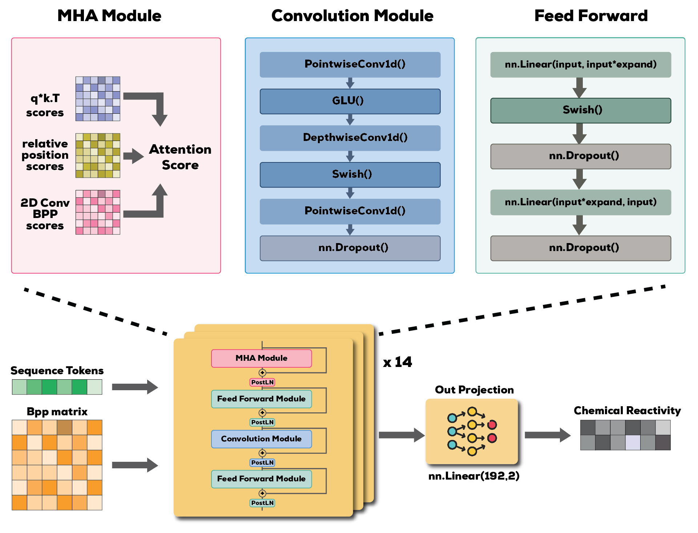

Hello!

Below you can find a outline of how to reproduce my solution for the [Stanford Ribonanza RNA Folding](https://www.kaggle.com/competitions/stanford-ribonanza-rna-folding/overview) competition.
If you run into any trouble with the setup/code or have any questions please contact me at <gosuxd1@gmail.com>

Below is the architectures of the 2 models used for the 3rd Place Solution
## Twin Tower Model

## Squeezeformer Model

#DATA SETUP
Data should be downloaded from Kaggle competition website and placed under /datamount/.
train_data.csv is then preprocessed with preprocess_dataset_to_parquet.py to create folded parquet file.

Optionally: preprocessed training_data.parquet and synthetic data used for final submission are included for quick start in training.

Since BPP's take a lot of disk, they can only be downloaded from competitions website. Place them under datamount/supp_data and preprocessed with preprocess_bpps.py script to create a bpps_index.csv and .npz files that are being used in the training of the model.

# Simple Squeezeformer training
`python train.py -C cfg_1` 
 
# EXAMPLE: change train configuration, use 1st GPU, disable neptune experiment tracking:
`python train.py -C cfg_1 -G 0 -batch_size 256 -lr 7e-4 -logging False`

# Simple twin-tower model training for 2 GPU setup
`python train_ddp -C cfg_2`

# EXAMPLE: Change train configuration, add comment for neptune experiment tracking
`python train_ddp.py -C cfg_2 -lr 1.5e-3 -epochs 50 -comment "Neptune comment for experiment"`

# Recreating 3rd place submission:
First twin-tower model is trained with the current configuration (cfg_2). Then with the twin-tower models weights synthetic data is created by running `python generate_synthetic.py`. Squeezeformer is then trained on both the clean dataset and synthetic dataset with the current configuration (cfg_1).

Simple blend from both models (0.5 weight each) is used for the final submission.
Pretrained weights of the final submission models are inside datamount/weights

#HARDWARE: (The following specs were used to create the original solution)
Ubuntu 22.04.3 LTS
CPU: i7-13700K (24 vCPUs)
2 x NVIDIA RTX 4090 (24GB each)
96GB RAM (2x32 GB + 2x64 GB)
1TB SSD

#SOFTWARE (python packages are detailed separately in `requirements.txt`):
python                    3.11.5
CUDA                      12.1
PyTorch                   2.1.0
